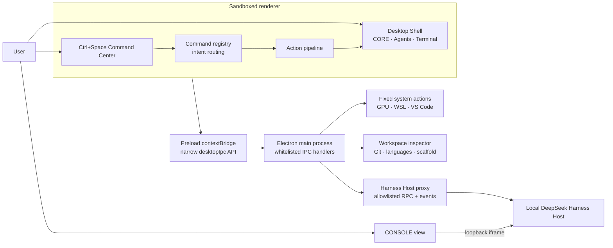

# Harness Core

> **An AI-native desktop command center built on top of DeepSeek Harness.**

Harness Core turns the local DeepSeek Harness runtime into a focused desktop workspace for AI-assisted development. It combines a global command center, workspace-aware AI, live execution state, agent activity, terminal output, system tooling, and the upstream Harness console in one Electron shell.

## Highlights

- **Ctrl+Space AI Command Center** — search commands, use keyboard-first navigation, or describe an intent in natural language.
- **Workspace-aware AI** — select a project, inspect its Git branch, languages, and scaffold, then bind Harness sessions to that workspace.
- **AI Core state visualization** — a central visual state machine for `IDLE`, `THINKING`, `PLANNING`, `EXECUTING`, `VERIFYING`, `DONE`, and `FAILED`.
- **Agent Panel** — maps the active AI Core state into clear orchestration and agent activity.
- **Terminal / Output** — streams action progress, system results, Harness responses, and failures into a persistent in-app output surface.
- **GPU integration** — queries NVIDIA GPU name, utilization, memory, and temperature through `nvidia-smi`, with graceful fallback when unavailable.
- **WSL integration** — detects WSL and its default distribution, reports status, and launches it from the command center.
- **VS Code integration** — opens the current workspace through the VS Code protocol with a local CLI fallback.
- **CORE / CONSOLE views** — switch between the native command-center experience and the local DeepSeek Harness web console.
- **Whitelisted Electron IPC** — renderer capabilities cross a narrow `contextBridge`; system actions and Harness methods are explicitly enumerated.
- **Cold-start optimization** — the splash, local desktop shell, and Harness Host start independently, so external service hydration does not block the shell reveal.
- **Smooth Splash/Desktop handoff** — the splash energy gate reveals a matching AI Core frame before the desktop chrome fades in, creating one continuous visual transition.

## Architecture



The startup path is deliberately decoupled:

1. Electron starts the splash, hidden local desktop shell, and DeepSeek Harness Host in parallel.
2. The local shell becomes reveal-ready without waiting for Host-backed services.
3. The splash energy gate reveals the matching desktop core and completes the handoff.
4. Harness sessions, event streaming, and the CONSOLE view hydrate when the local Host is ready.

Commands flow through a registry and action pipeline that keeps the AI Core, Agent Panel, and Terminal synchronized. Privileged operations remain in the Electron main process; the renderer never receives direct Node.js access.

## Project Structure

```text
Harness Core/
├─ src/
│  ├─ desktop/              # Command center UI, actions, panels, and Host events
│  │  ├─ desktop.html       # CORE / CONSOLE desktop shell
│  │  ├─ desktop.css        # Desktop and handoff visuals
│  │  ├─ app.js             # Boot phases, views, shortcuts, and orchestration
│  │  ├─ commands.js        # Command registry, ranking, and intent routing
│  │  ├─ actions.js         # Plan → execute → verify action pipeline
│  │  ├─ builtins.js        # Workspace, GPU, WSL, VS Code, and AI commands
│  │  ├─ panels.js          # Agent, workspace, terminal, and system panels
│  │  ├─ hostevents.js      # Harness sessions and streamed responses
│  │  ├─ core.js            # AI Core visualization and state machine
│  │  └─ preload.js         # Narrow renderer-to-main bridge
│  ├─ lib/types/            # Main-process desktop integration modules
│  │  ├─ desktop-config.js  # IPC channels, Host allowlist, limits, and caches
│  │  ├─ desktop-ipc.js     # Validated IPC handlers
│  │  ├─ desktop-system.js  # GPU, WSL, VS Code, and system status adapters
│  │  ├─ desktop-workspace.js # Workspace metadata inspection
│  │  └─ desktop-host.js    # Local Harness RPC and event proxy
│  └─ splash/               # Splash renderer and Desktop handoff
└─ tools/                   # Logic, integration, live, packaging, and visual checks
```

Generated packages, extracted applications, local binaries, screenshots, logs, and other verification artifacts are intentionally excluded from version control.

## Validation

The current validation baseline is **185/185 passing assertions**:

| Suite | Coverage | Result |
| --- | --- | ---: |
| Splash logic | animation lifecycle, reduced motion, energy-gate reveal, handoff idempotency | **59/59** |
| Desktop logic | command routing, action state, system adapters, Host proxy and events | **61/61** |
| Desktop app integration | boot/reveal, Command Center, panels, shortcuts, streamed UI state | **42/42** |
| Workspace integration | real directory inspection, Git metadata, language and scaffold detection | **23/23** |
| **Total** |  | **185/185** |

Additional verification tooling covers real local Host calls, GPU/WSL integration, ASAR pack/extract round trips, cold-start behavior, and visual capture of the Splash/Desktop transition.

## Security Model

Harness Core uses Electron as a privilege boundary, not as a general-purpose shell exposed to the UI.

- Desktop and splash renderers use `sandbox: true`, `contextIsolation: true`, and `nodeIntegration: false`.
- The desktop Content Security Policy defaults to no access and permits only local assets plus loopback framing for the Harness console.
- The preload layer exposes a small, named `desktopIpc` surface instead of raw `ipcRenderer` access.
- Every renderer-to-main IPC channel is explicitly named and registered.
- Harness RPC calls are restricted to an allowlist of required Host, session, workspace, provider, and model methods.
- Process launches use known executables and fixed argument layouts; there is no arbitrary renderer-provided command execution.
- External URLs are restricted to HTTP(S), and workspace/path inputs are validated before main-process use.
- System polling is throttled or cached, and workspace scans and subprocess probes have hard limits and timeouts.
- The Harness Host and CONSOLE iframe remain on the local loopback interface.

## Upstream / Attribution

**Harness Core is an independent extension layer built on top of DeepSeek Harness.**

**DeepSeek Harness itself is not authored by this project.**

**Upstream binaries and unchanged upstream source files are not redistributed.**

This repository focuses on the original desktop command-center layer, system and workspace integrations, security boundary, startup handoff, and validation tooling. A compatible local DeepSeek Harness installation is expected to provide the upstream runtime and web Host.

## Status

Harness Core is a functional, Windows-oriented desktop extension under active development. The command center, workspace integration, AI Core visualization, Agent and Terminal panels, GPU/WSL/VS Code actions, Harness Host bridge, security boundary, and optimized boot handoff are implemented and covered by the validation baseline above.

The project is not a standalone DeepSeek Harness distribution. Interfaces, packaging, and compatibility requirements may evolve while the extension layer is refined for broader use.
